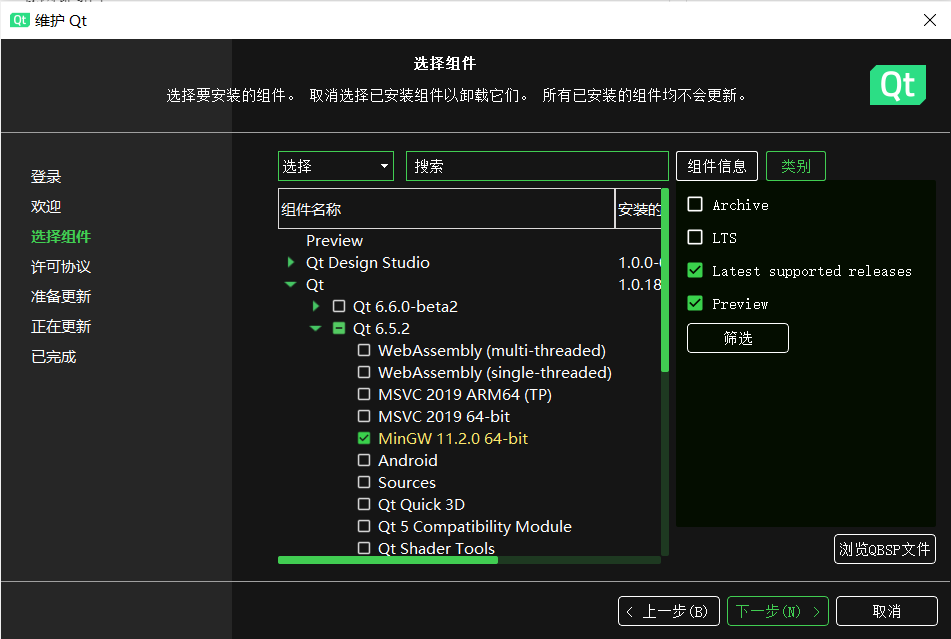

可在以下网址下载最新版本的源代码：
https://github.com/hahahaha-you/BNB_Cplusplus
# 第三方库配置 
本工程采用Qt6图形库，请从网上下载在线安装程序进行下载安装，下载网址如下：  
https://www.qt.io/download-qt-installer-oss?hsCtaTracking=99d9dd4f-5681-48d2-b096-470725510d34%7C074ddad0-fdef-4e53-8aa8-5e8a876d6ab4  
在该网址下根据自己电脑的系统选择下载对应的安装程序。  
进入安装程序后，在“选择组件”部分（如下图，我这里是维护Qt程序，但是程序界面是大体相同的），选择一个Qt版本（第一个版本号要为6，我选择的是6.5.1），在对应的版本下面勾选安装对应的第三方库（库名要与自己所要使用的编译器名相一致，比如我使用MinGW编译器，就选择MinGW 11.2.0 64-bit），进行安装。  
  
（本人使用Windows10系统，在安装完成后，需要将Qt的第三方库路径（形如“C:\Qt\6.5.1\mingw_64\bin”）添加进Path环境变量）
# 构建
在构建前，请先将code文件夹下的CMakeLists.txt文件中设置的编译器路径（在第4、5行）改为自己在电脑上的编译器所在的路径。  
本人使用Windows10系统，在其下用cmake+MinGW进行构建并生成可执行文件。（MinGW经过一些处理：在其二进制文件（bin）目录下，将mingw32-make.exe复制粘贴一份，并将得到的新文件命名为make.exe）  
使用命令行工具进入code目录后，构建命令如下：
```
mkdir build
cd build
cmake .. -G "MinGW Makefiles"
make
```
这样，在build子目录中即存在可执行文件BNB.exe。双击该文件，即可打开运行泡泡堂游戏。