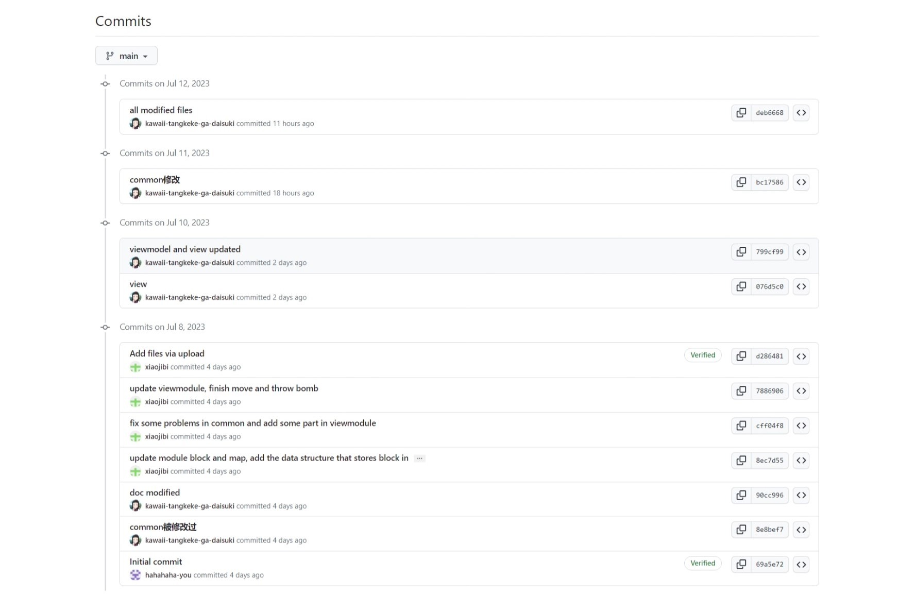

# 中期总结
## 1、总结背景：
   本项目是一款经典玩家对抗小游戏：泡泡堂。  第一轮迭代结束，本项目实现了部分基础功能。
## 2、项目成果及功能介绍
### 2.1 游戏图像界面
   在本轮迭代后，本项目实现了基本的图形界面。程序开始运行时，先出现开始界面，如下图。  
    
   点击“开始游戏”按钮，即可加载出如下游戏地图。 
   
   该界面由方格状地图及卡通人物组成。地图的每一个小格表示一种地图块，目前共有三种地图块，分别为道路、箱子、坚石。（如下图）  
       
   其中人物可以在道路上自由行走，而且人物朝向随行走方向改变，两者保持一致；箱子可以被后续实现的武器系统破坏，坚石不可摧毁。  
   

#### 2.2 游戏人物的操控
   本项目实现的游戏支持两位玩家共同操作，每位玩家可以控制一个卡通人物进行移动、使用武器攻击人物及箱子，在本轮迭代后，本项目实现了人物移动的基本操作，两位玩家可以同时控制不同人物在道路上自由移动，且其遇到箱子或坚石后会停止。武器系统暂未实现。  
   下两图分别为人物向左和向下移动后的效果图。  
     

## 3、 技术难点
### 3.1参数调整
为了提高游戏的可玩度，我们对人物移动的速度、地图的大小、不同物块的数量等参数进行测试调整，并最终完成教务适宜的视图界面。

### 3.2框架理解
在完成本项目前，我们对MVVM框架的理解不够深入，对view层和viewModel间关系以及连接等方面的认知有所不足，在实现时也遇到了模块耦合度较高的问题。但经过老师的指导以及资料的查阅，我们最终降低了view层和viewModel层的耦合，并在App层将其连接，设计并实现了一种较为合理的框架。

### 3.3对象设计
在项目实现前，我们对项目进行了整体的理解与规划，并基于此设计并完成了common层的内容。但随着程序进度的推进，我们在viewModel层发现了common层设计的一些不足并为功能的实现带来一定的困难。

### 3.4工具使用
在实现本项目的图像界面时，我们使用了Qt库。由于对Qt库的陌生，我们在实现时遇到了一些问题，如如何同时控制多个按键、如何连接影响模块外的对象等。但最终，我们都解决了这些问题。

## 4、总体心得
在完成项目的过程中，我们学到了很多关于C++工程框架的知识。在实践中，我们发现了很多不足，也意识到MVVM架构不同层次的功能、编写方法以及注意事项。在实现程序功能的过程的初期，由于对整体架构的理解不到位，我们的程序设计存在一定的问题，view层与viewmodel、common层都有一定的耦合。但在老师的指导下，我们不断优化结构，并使用信号、槽函数机制来连接对象，最终使得底层的模块间相互独立，并在app层连接。同时我们也遇到了一些问题，有测试方面的问题。在程序运行出现异常结果时，我们需要对不同模块进行测试以定位代码的出错位置，这给我们带来一定的困难。其中，代码的解耦对定位错误帮助很大。当发现某个功能出错，我们可以很容易地找到实现该功能的层。当代码耦合度较低时，由于涉及的层数和代码较少，定位错误也就更容易了。

## 5、个人心得
张书维：本次项目中我感觉项目合作对总体设计的要求较高，需要在实现程序前做出一个合理、较为完备的框架。同时，我也感受到降低程序耦合性的必要性，这对于我们彼此独立开发项目以及最后的拼接模块都意义深远。在开发viewmodel层时，我更深切地体会到底层实现完备的重要性，我们小组对底层的做了许多后期的修改，这影响到团队协作的进行以及项目进度的推进。同时在于view层协作时，我学会了信号、槽函数这一机制的使用，学到了一种在彼此并不依赖的情况下连接对象的方法，这促使我对项目框架设计以及模块连接等方面有了更深刻的理解。

夏尤楷：在完成view层的时候，令我感到疑惑的地方是：明明view和viewmodel层互不耦合，但是在view层检测到键盘操作后，viewmodel层要对相应的对象进行修改。这要怎么实现呢？后来我们了解到可以使用Qt中的信号-槽函数实现两层之间的通信，而我负责的view层只需要负责发出信号，在App层将该信号和viewmodel层的槽连接在一起，就可以实现根据view层检测到的操作，由viewmodel层对相应对象进行修改，从而成功解决了这个问题。在解决这个问题的途中，我们对view层和viewmodel层的联系的形式和本质有了更深刻的认识。  

郭一川：感觉C++工程的关键就是解耦。很多错误都出在框架上。此外，在实现common层的时候，我觉得最重要的是需要预留出后几次迭代的功能，不能只考虑第一次迭代，否则在之后的迭代中需要做的修改太多，代码的可重用性不高。其次要想清楚common真正的功能是什么，不能越俎代庖写掉本应属于viewmodel的部分，导致耦合。

## 6、协作情况
张书维：viewmodel层, 修改完善common层，修改完善程序  
夏尤楷：view层和app层，修改完善程序  
郭一川：common层  

我们使用git和gitHub更新、同步代码并控制版本。版本控制过程如下图：  
  
初期，我们小组完成各模块的任务，在各模块完成后，我们发现view模块和viewmodel模块出现耦合，于是在同一个人的设备上进行解耦修改，并将解耦成功后的代码进行提交。中途对代码风格有过一些修正并提交。